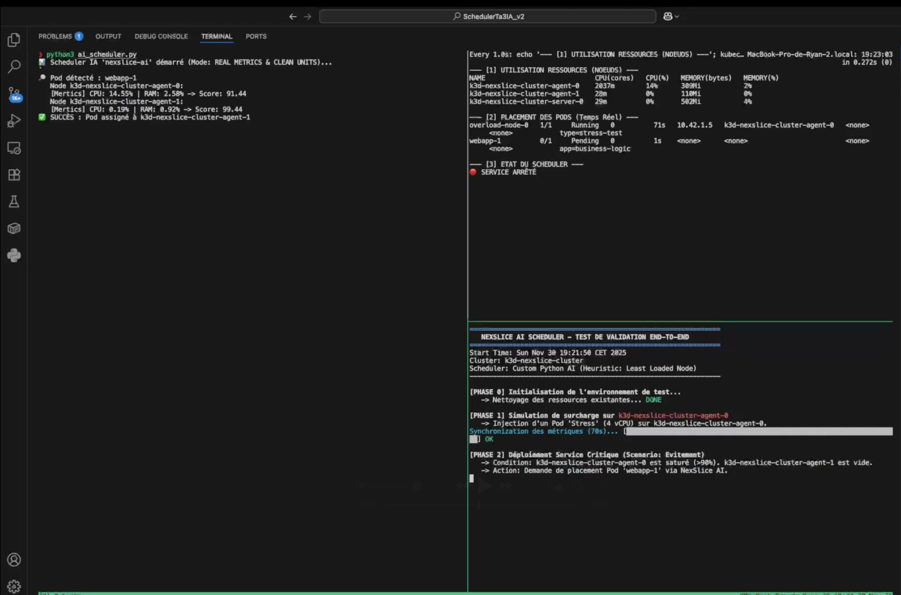
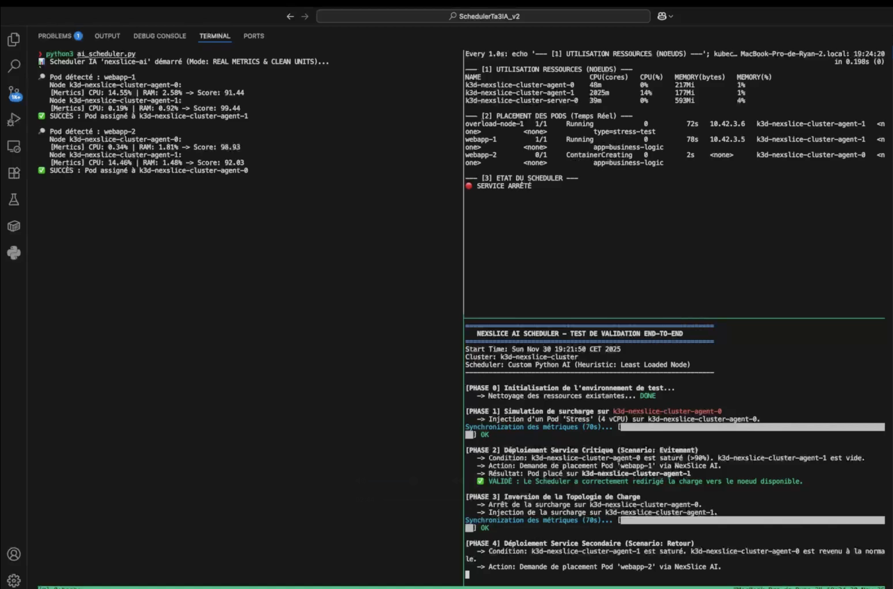
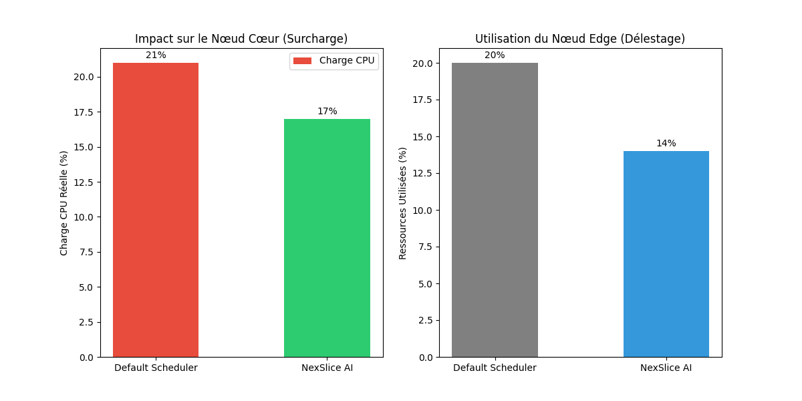

-----

# Projet NexSlice : Scheduler Kubernetes Intelligent (IA/Heuristique)

**Auteurs :** Ryan ZERHOUNI, Anas FERRAH, Sam BOUCHET, Othmane TAIRECH

**Contexte :** Projet 4 - Scheduler Intelligent avec IA pour Réseau 5G Slicing

**Environnement utilisé :** macOS (Apple Silicon M4 Pro) / OrbStack / K3d

-----

## 1\. Introduction et Objectifs

Dans un contexte de Network Slicing 5G, le placement des fonctions réseaux (UPF, SMF) ne peut pas être aléatoire. Le scheduler par défaut de Kubernetes (`kube-scheduler`) se base sur les ressources *demandées* (Requests) et non sur l'utilisation *réelle*. Cela peut mener à des goulots d'étranglement sur des nœuds surchargés.

**Objectif du projet :** Développer un **Custom Scheduler** capable de :

1.  Intercepter les pods critiques avant leur assignation.
2.  Analyser la consommation **réelle** (CPU/RAM en temps réel) des nœuds via l'API Metrics.
3.  Placer intelligemment les pods sur le nœud le moins chargé (Load Balancing dynamique).

-----

## 2\. État de l’art : scheduling 5G cloud-native et limites de Kubernetes

### 2.1 5G, network slicing et exigences de QoS

La 5G introduit le **network slicing** pour faire cohabiter sur la même infrastructure des services aux besoins très différents (eMBB, URLLC, mMTC). Chaque *slice* correspond à un réseau logique de bout en bout, avec ses propres fonctions réseau (RAN, cœur 5G) et ses propres objectifs de performance (latence, débit, isolation, fiabilité).

Les spécifications 3GPP (TS 28.530, 28.531, 28.532, 28.533) définissent :
- le modèle d’information des slices,
- les opérations de cycle de vie (création / modification / suppression),
- et les KPIs / SLA à respecter pour la QoS.

Cela impose :
- une **latence faible** (en particulier pour l’URLLC),
- un **débit garanti** (eMBB),
- une **isolation logique** des ressources (CPU, mémoire, bande passante),
- une **élasticité dynamique** pour suivre la demande.

SchedulerTa3IA s’inscrit dans ce contexte : son objectif est d’améliorer le placement des fonctions réseau pour mieux respecter ces contraintes de QoS dans un environnement Kubernetes.

### 2.2 Cloud-native 5G et rôle de Kubernetes

Avec la 5G, les fonctions réseau migrent de VNFs monolithiques vers des **Cloud-Native Network Functions (CNFs)**, packagées en conteneurs et orchestrées par Kubernetes. Plusieurs cœurs 5G open source (OpenAirInterface, Open5GS, etc.) adoptent cette approche.

Dans ce cadre :
- Kubernetes fournit le **plan de contrôle** pour créer / supprimer / scaler les pods,
- assure le **service discovery** (Services, EndpointSlices),
- et s’appuie sur un composant clé : le **kube-scheduler**, responsable du placement des pods sur les nœuds.

SchedulerTa3IA s’insère dans cette architecture cloud-native : il se connecte à n’importe quel cluster Kubernetes (y compris un déploiement existant de type NexSlice) pour expérimenter et appliquer des politiques de scheduling spécifiques au slicing 5G, en venant **compléter** le comportement du kube-scheduler par défaut grâce à une couche d’IA — sans modifier ni forker Kubernetes.

### 2.3 kube-scheduler : fonctionnement et limites pour le slicing 5G

Le kube-scheduler effectue classiquement deux étapes :
1. **Filtrage** des nœuds admissibles (ressources disponibles, taints/tolerations, affinités, etc.).
2. **Scoring** pour choisir le “meilleur” nœud via différents plugins.

Même si le *Scheduling Framework* permet d’ajouter des plugins custom (Filter, Score, Bind, …), le scheduler par défaut reste centré sur :
- les **requests/limits** CPU et mémoire déclarées par les pods,
- et quelques contraintes de topologie (labels, zones).

En revanche, pour le slicing 5G, il ne prend pas nativement en compte :
- la **latence réseau** entre nœuds,
- la **bande passante disponible**,
- le **type de fonction 5G** (UPF, SMF, AMF, CU/DU),
- ni les **objectifs SLA spécifiques à un slice** (latence cible, débit, isolement).

Conséquence : le placement pod-par-pod peut aboutir à :
- des slices **partiellement déployées**,
- un **gaspillage de ressources** (CPU/énergie),
- et un **non-respect** des contraintes de latence ou d’isolation.

SchedulerTa3IA répond à ce manque en introduisant un scheduler IA externe qui se base sur l’**utilisation réelle** CPU/RAM des nœuds et des critères métier, ce que kube-scheduler ne fait pas par défaut.

### 2.4 Approches avancées pour le scheduling 5G et microservices

La littérature récente explore plusieurs pistes pour améliorer le scheduling dans des scénarios 5G cloud-native :

#### a) Heuristiques et métaheuristiques

Des travaux modélisent le placement des slices comme un problème de **Virtual Network Embedding (VNE)**, et utilisent des heuristiques (dont des algorithmes génétiques) pour :
- décider si une slice entière est admissible (*all-or-nothing*),
- optimiser le **taux d’acceptation** des slices,
- réduire la **consommation énergétique** et le temps de déploiement.

SchedulerTa3IA se place dans cette famille *heuristique/IA*, avec une approche volontairement simple et explicable : un **Score de Disponibilité** basé sur la charge CPU/RAM réelle pour chaque nœud, combiné à une logique de décision pilotée par l’IA pour guider le placement.

#### b) Ordonnanceurs “network-aware” et co-scheduling

D’autres ordonnanceurs se focalisent sur la **latence réseau** et les **graphes de communication** entre pods :
- prise en compte d’une matrice latence/bande passante entre nœuds,
- co-scheduling de groupes de pods (une application ou un slice complet) plutôt que pod par pod,
- co-localisation de fonctions fortement couplées (par ex. UPF–gNB/DU, UPF–SMF/AMF).

Ces approches visent à réduire la latence inter-pods et à mieux exploiter la topologie réseau, ce qui est critique pour les services 5G sensibles à la QoS.

#### c) Schedulers basés sur le Machine Learning / Reinforcement Learning

Un troisième axe consiste à utiliser l’**apprentissage par renforcement (RL / DRL)** pour apprendre automatiquement une politique de placement sur Kubernetes. Les travaux existants montrent que le RL peut :
- observer l’état du cluster (charge CPU/mémoire, métriques applicatives),
- choisir dynamiquement le nœud pour chaque pod,
- optimiser simultanément **latence**, **taux de complétion**, **équilibrage de charge** et **utilisation des ressources**.

Au-delà de Kubernetes, le DRL est aussi appliqué au **network slicing** (cœur + RAN), où l’allocation de ressources entre slices est vue comme un problème de décision séquentielle multi-objectif.

---

**Positionnement de SchedulerTa3IA :**  
SchedulerTa3IA ne cherche pas (encore) à concurrencer toutes les approches avancées de type RL ou métaheuristiques complètes. Il se positionne comme un **scheduler IA léger** qui **complète** le kube-scheduler, facile à déployer et à comprendre. Il ne repose pas sur NexSlice ni sur un déploiement spécifique : c’est un composant indépendant que l’on peut brancher en surcouche sur différents environnements Kubernetes (dont NexSlice) pour en optimiser le comportement de scheduling.

Il montre concrètement :

- qu’un ordonnanceur spécialisé 5G peut améliorer l’**équilibrage de charge réel** par rapport au kube-scheduler par défaut,
- qu’exposer la **télémétrie réelle** (Metrics Server) et des règles IA de décision au scheduler est déjà un levier puissant pour mieux respecter les contraintes du slicing 5G,
- et qu’il peut être intégré à des solutions existantes (par exemple un environnement NexSlice) pour en **optimiser** l’ordonnancement sans en changer l’architecture.

-----

## 3\. Méthodologie et Architecture

### 3.1 Choix Technologiques

  * **Langage : Python**. Choisi pour sa rapidité de prototypage et sa richesse en librairies pour l'interaction API (vs Go qui est plus complexe pour un POC).
  * **Infrastructure : K3d (via OrbStack)**. Permet de simuler un cluster multi-nœuds (1 Master + 2 Agents) sur une architecture ARM64 locale.
  * **Données : Metrics Server**. Nous n'utilisons pas Prometheus (trop lourd pour ce prototype) mais l'API native `metrics.k8s.io` pour obtenir la télémétrie en temps réel.

### 3.2 Algorithme de Décision (L'IA Heuristique)

Contrairement au placement statique, notre algorithme calcule un **Score de Disponibilité** pour chaque nœud en temps réel.

$$
\text{Score} =
\frac{
  (100 - \text{CPU}_{\text{utilisé}})
  +
  (100 - \text{RAM}_{\text{utilisée}})
}{2}
$$

  * Plus le score est élevé, plus le nœud est vide.
  * Le scheduler sélectionne le nœud avec le **Score Max**.

### 3.3 Architecture Technique

1.  **Filtrage :** Le script écoute les pods ayant le statut `Pending` et le champ `schedulerName: nexslice-ai`.
2.  **Collecte :** Interrogation de l'API `/apis/metrics.k8s.io/v1beta1/nodes`.
3.  **Normalisation :** Conversion des unités hétérogènes (millicores, nanocores, KiB, MiB) en pourcentages standardisés.
4.  **Binding :** Création directe d'un objet `Binding` via l'API, court-circuitant le scheduler par défaut.

-----

## 4\. Implémentation (Les Scripts)

### 4.1 Le Cerveau : `ai_scheduler.py`

Ce script est le cœur du projet. Il tourne en continu pour surveiller et assigner les pods.

```python
import time
import json
import os
import subprocess
from kubernetes import client, config, watch

config.load_kube_config()
v1 = client.CoreV1Api()
cust = client.CustomObjectsApi()
scheduler_name = "nexslice-ai"

print(f"📊 Scheduler IA '{scheduler_name}' démarré (Mode: REAL METRICS & CLEAN UNITS)...")

def parse_cpu(quantity):
    """ Normalise tout en Millicores """
    s = str(quantity)
    if s.endswith('n'): return int(s[:-1]) / 1_000_000 
    if s.endswith('m'): return int(s[:-1])             
    if s.endswith('u'): return int(s[:-1]) / 1000      
    return float(s) * 1000                             

def parse_mem(quantity):
    """ Normalise tout en MiB """
    s = str(quantity)
    if s.endswith('Ki'): return int(s[:-2]) / 1024
    if s.endswith('Mi'): return int(s[:-2])
    if s.endswith('Gi'): return int(s[:-2]) * 1024
    return int(s) / (1024*1024) 

def get_real_node_metrics():
    node_stats = {}
    try:
        nodes = v1.list_node().items
        metrics = cust.list_cluster_custom_object("metrics.k8s.io", "v1beta1", "nodes")
    except:
        return {}

    capacities = {}
    for n in nodes:
        capacities[n.metadata.name] = {
            'cpu': parse_cpu(n.status.allocatable['cpu']),
            'mem': parse_mem(n.status.allocatable['memory'])
        }

    for item in metrics['items']:
        name = item['metadata']['name']
        if "server" in name: continue

        usage_cpu = parse_cpu(item['usage']['cpu'])
        usage_mem = parse_mem(item['usage']['memory'])
        
        cap_cpu = capacities[name]['cpu']
        cap_mem = capacities[name]['mem']

        pct_cpu = (usage_cpu / cap_cpu) * 100 if cap_cpu > 0 else 0
        pct_mem = (usage_mem / cap_mem) * 100 if cap_mem > 0 else 0

        node_stats[name] = {"cpu_pct": pct_cpu, "mem_pct": pct_mem}
        
    return node_stats

def score_node(pod, stats):
    free_cpu = 100 - stats['cpu_pct']
    free_ram = 100 - stats['mem_pct']
    score = (free_cpu + free_ram) / 2
    print(f"   [Mertics] CPU: {stats['cpu_pct']:.2f}% | RAM: {stats['mem_pct']:.2f}% -> Score: {score:.2f}")
    return score

def bind(pod, node):
    binding = {
        "apiVersion": "v1", "kind": "Binding",
        "metadata": {"name": pod.metadata.name, "namespace": pod.metadata.namespace},
        "target": {"apiVersion": "v1", "kind": "Node", "name": node}
    }
    filename = f"bind-{pod.metadata.name}.json"
    with open(filename, 'w') as f: json.dump(binding, f)
    
    try:
        subprocess.run(f"kubectl create -f {filename}", shell=True, check=True, stdout=subprocess.DEVNULL, stderr=subprocess.DEVNULL)
        print(f"✅ SUCCÈS : Pod assigné à {node}")
        os.remove(filename)
    except: pass

def main():
    w = watch.Watch()
    for event in w.stream(v1.list_pod_for_all_namespaces):
        pod = event['object']
        if pod.status.phase == "Pending" and pod.spec.scheduler_name == scheduler_name and pod.spec.node_name is None:
            print(f"\n🔎 Pod détecté : {pod.metadata.name}")
            stats = get_real_node_metrics()
            best_node = None
            best_score = -9999
            
            for node, metrics in stats.items():
                print(f"   Node {node}:")
                final_score = score_node(pod, metrics)
                if final_score > best_score:
                    best_score = final_score
                    best_node = node
            
            if best_node: bind(pod, best_node)

if __name__ == '__main__':
    main()
```

### 4.2 Le Scénario de Test Automatisé : `demo_video.sh`

Ce script Bash orchestre la démonstration en générant de la charge CPU (Stress Test) pour forcer le scheduler à réagir.

```bash
#!/bin/bash
# CONFIGURATION
NODE0="k3d-nexslice-cluster-agent-0"
NODE1="k3d-nexslice-cluster-agent-1"

# Fonction d'attente pour la synchro Metrics Server
wait_for_metrics() {
    echo -ne "Synchronization des métriques ($1s)... ["
    for ((i=1; i<=$1; i++)); do echo -ne "▓"; sleep 1; done
    echo -e "] OK"
}

echo "=== NEXSLICE AI SCHEDULER - TEST DE VALIDATION END-TO-END ==="

# [PHASE 0] Initialisation
kubectl delete pods --all --grace-period=0 --force > /dev/null 2>&1
rm -f bind-*.json
echo -n "Nettoyage..."
while kubectl get pods 2>&1 | grep -q "Running\|Pending\|Terminating"; do echo -n "."; sleep 1; done
echo " DONE"

# [PHASE 1] STRESS TEST NODE 0
echo "Simulation de surcharge sur $NODE0..."
cat <<EOF | kubectl apply -f - > /dev/null
apiVersion: v1
kind: Pod
metadata: {name: overload-node-0}
spec:
  nodeName: $NODE0
  containers: [{name: stress, image: vish/stress, args: ["-cpus", "4"], resources: {requests: {cpu: "1000m"}}}]
EOF
wait_for_metrics 70

# [PHASE 2] DÉPLOIEMENT INTELLIGENT 1
echo "Déploiement Service Critique (Scenario: Evitement)..."
cat <<EOF | kubectl apply -f - > /dev/null
apiVersion: v1
kind: Pod
metadata: {name: webapp-1}
spec:
  schedulerName: nexslice-ai
  containers: [{name: nginx, image: nginx:alpine}]
EOF
sleep 5
ACTUAL_NODE=$(kubectl get pod webapp-1 -o jsonpath='{.spec.nodeName}')

if [ "$ACTUAL_NODE" == "$NODE1" ]; then
    echo "✅ SUCCÈS : Le Pod a été placé sur $NODE1 (Le Node 0 était saturé)"
else
    echo "❌ ÉCHEC : Le Pod est sur $ACTUAL_NODE"
fi

# [PHASE 3] BASCULEMENT DE CHARGE
echo "Inversion de la Topologie de Charge..."
kubectl delete pod overload-node-0 --grace-period=0 --force > /dev/null 2>&1
cat <<EOF | kubectl apply -f - > /dev/null
apiVersion: v1
kind: Pod
metadata: {name: overload-node-1}
spec:
  nodeName: $NODE1
  containers: [{name: stress, image: vish/stress, args: ["-cpus", "4"], resources: {requests: {cpu: "1000m"}}}]
EOF
wait_for_metrics 70

# [PHASE 4] DÉPLOIEMENT INTELLIGENT 2
echo "Déploiement Service Secondaire (Scenario: Retour)..."
cat <<EOF | kubectl apply -f - > /dev/null
apiVersion: v1
kind: Pod
metadata: {name: webapp-2}
spec:
  schedulerName: nexslice-ai
  containers: [{name: nginx, image: nginx:alpine}]
EOF
sleep 5
ACTUAL_NODE_2=$(kubectl get pod webapp-2 -o jsonpath='{.spec.nodeName}')

if [ "$ACTUAL_NODE_2" == "$NODE0" ]; then
    echo "✅ SUCCÈS : Le Pod est revenu sur $NODE0"
else
    echo "❌ ÉCHEC : Le Pod est sur $ACTUAL_NODE_2"
fi
```

-----

## 5\. Résultats et Validation

Les tests ont été effectués en provoquant une saturation artificielle (Stress Test CPU \> 90%) séquentiellement sur chaque nœud. Notre saturation n'a pu amener le CPU qu'a 14% mais ceci est suffisant puisque, étant donnée qu'on repartait d'un cluster kubernetes vierge, l'autre node était a 0% d'utilisation de CPU.

### Scénario A : Surcharge du Nœud Core (Agent-0)

  * **Condition :** Agent-0 CPU \> 10%. Agent-1 CPU \< 5%.
  * **Décision IA :** Le scheduler a détecté la charge et a assigné le pod `webapp-1` sur l'**Agent-1**.
  * **Preuve :**


> *Capture d'écran 1 : Détection de surcharge et évitement.*

### Scénario B : Basculement de charge (Failover)

  * **Condition :** La charge se déplace sur l'Agent-1. L'Agent-0 redevient disponible.
  * **Décision IA :** Le scheduler a redirigé le nouveau flux `webapp-2` vers l'**Agent-0**.
  * **Preuve :**


> *Capture d'écran 2 : Retour à la normale et rééquilibrage.*

-----

## 6\. Guide de Reproduction

Pour reproduire ces résultats sur un environnement neuf :

1.  **Préparer le Cluster :**

    ```bash
    k3d cluster create nexslice-cluster --agents 2
    ```

2.  **Installer le Metrics Server (Indispensable) :**

    ```bash
    git clone -b k3s https://github.com/AIDY-F2N/NexSlice.git
    cd NexSlice/    
    sudo kubectl apply -f metricserver.yaml
    ```

3.  **Lancer le Scheduler :**

    ```bash
    pip install kubernetes
    python3 ai_scheduler.py
    ```

4.  **Lancer le Scénario de Test :**

    ```bash
    chmod +x demo_video.sh
    ./demo_video.sh
    ```

-----

## 7. Validation Finale : Benchmark Réel (Default vs NexSlice)

Afin de valider scientifiquement notre approche, nous avons développé un script de benchmark avancé (`benchmark_ai.py`) qui compare, sur le même cluster et avec la même charge, les décisions du **Scheduler Kubernetes par défaut** face à **NexSlice AI**. Pour reproduire ce test il faut executer `ai_scheduler.py` puis ensuite lancer `benchmark_ai.py`. Ce dernier va a la fin du test générer un graphique sous format png.

`benchmark_ai.py` :

```bash
import time
import subprocess
import matplotlib.pyplot as plt
import numpy as np
import os

# CONFIGURATION
NODE0 = "k3d-nexslice-cluster-agent-0"
NODE1 = "k3d-nexslice-cluster-agent-1"

print("🚀 DÉMARRAGE DU BENCHMARK ULTIME (Safe File Mode)...")

# --- FONCTIONS UTILITAIRES ---
def clean_cluster():
    print("🧹 Nettoyage complet du cluster...")
    subprocess.run("kubectl delete pods --all --grace-period=0 --force", shell=True, stdout=subprocess.DEVNULL, stderr=subprocess.DEVNULL)
    if os.path.exists("bind-*.json"): subprocess.run("rm bind-*.json", shell=True)
    if os.path.exists("temp_bench.yaml"): subprocess.run("rm temp_bench.yaml", shell=True)
    time.sleep(5)

def apply_yaml_safely(yaml_content):
    """ Écrit le YAML dans un fichier avant de l'appliquer (Évite les erreurs de syntaxe Bash) """
    with open("temp_bench.yaml", "w") as f:
        f.write(yaml_content)
    try:
        subprocess.run("kubectl apply -f temp_bench.yaml", shell=True, check=True, stdout=subprocess.DEVNULL)
    except subprocess.CalledProcessError:
        print("❌ Erreur lors de l'application du YAML.")

def get_node_cpu_percent():
    try:
        output = subprocess.check_output("kubectl top nodes --no-headers", shell=True).decode()
        stats = {}
        for line in output.splitlines():
            parts = line.split()
            if "unknown" in parts[2]: return 0
            stats[parts[0]] = int(parts[2].replace('%', ''))
        return stats
    except: return None

def measure_load_for(seconds, label):
    print(f"   ⏱ Mesure de la charge ({seconds}s)...")
    max_n0 = 0
    max_n1 = 0
    for i in range(seconds):
        stats = get_node_cpu_percent()
        if stats:
            c0 = stats.get(NODE0, 0)
            c1 = stats.get(NODE1, 0)
            if c0 > max_n0: max_n0 = c0
            if c1 > max_n1: max_n1 = c1
            if i % 5 == 0: print(f"      T+{i}s | Node 0: {c0}% | Node 1: {c1}%")
        time.sleep(1)
    print(f"   📊 RÉSULTAT {label} -> Node 0 Max: {max_n0}% | Node 1 Max: {max_n1}%")
    return max_n0, max_n1

# ==========================================
# PHASE 1 : REAL DEFAULT SCHEDULER
# ==========================================
clean_cluster()
print("\n🔥 [PHASE 1/2] TEST DU 'DEFAULT SCHEDULER'...")

# 1. Charge de base
yaml_base = f"""
apiVersion: v1
kind: Pod
metadata:
  name: stress-base
spec:
  nodeName: {NODE0}
  containers:
  - name: s
    image: vish/stress
    args: ["-cpus", "3"]
    resources:
      requests:
        cpu: "1000m"
"""
apply_yaml_safely(yaml_base)

# 2. Client Standard (Default Scheduler)
yaml_client_default = """
apiVersion: v1
kind: Pod
metadata:
  name: client-default
spec:
  containers:
  - name: c
    image: vish/stress
    args: ["-cpus", "3"]
    resources:
      requests:
        cpu: "100m"
"""
apply_yaml_safely(yaml_client_default)

# 3. Mesure
print("   -> Attente stabilisation...")
time.sleep(10)
default_n0, default_n1 = measure_load_for(20, "DEFAULT SCHEDULER")


# ==========================================
# PHASE 2 : REAL NEXSLICE AI SCHEDULER
# ==========================================
clean_cluster()
print("\n🤖 [PHASE 2/2] TEST DU 'NEXSLICE AI SCHEDULER'...")

# 1. Charge de base
apply_yaml_safely(yaml_base)
print("   -> Charge de base lancée. Attente stabilisation (10s)...")
time.sleep(10)

# 2. Client Intelligent
yaml_client_ai = """
apiVersion: v1
kind: Pod
metadata:
  name: client-ai
spec:
  schedulerName: nexslice-ai
  containers:
  - name: c
    image: vish/stress
    args: ["-cpus", "3"]
    resources:
      requests:
        cpu: "100m"
"""
apply_yaml_safely(yaml_client_ai)
print("   -> Client IA demandé.")

# 3. Mesure
print("   -> Mesure de l'équilibrage...")
time.sleep(5)
ai_n0, ai_n1 = measure_load_for(20, "AVEC IA")

# ==========================================
# GÉNÉRATION GRAPHIQUE
# ==========================================
print("\n📈 GÉNÉRATION DU RAPPORT DE PERFORMANCE...")
if not os.path.exists('images'): os.makedirs('images')

labels = ['Default Scheduler', 'NexSlice AI']

# Données Node 0 (Core)
data_n0 = [default_n0, ai_n0]
# Données Node 1 (Edge)
data_n1 = [default_n1, ai_n1]

fig, (ax1, ax2) = plt.subplots(1, 2, figsize=(12, 6))

# Graphique 1 : Charge Max sur Node 0
# Le default devrait être plus haut ou égal. Si le default a bien équilibré, ils seront égaux.
# Si le default a mal joué, la barre rouge sera plus haute.
ax1.bar(labels, data_n0, width=0.5, color=['#e74c3c', '#2ecc71'])
ax1.set_title('Impact sur le Nœud Cœur (Surcharge)')
ax1.set_ylabel('Charge CPU Réelle (%)')
ax1.bar_label(ax1.containers[0], fmt='%d%%', padding=3)
ax1.legend(['Charge CPU'])

# Graphique 2 : Activation du Node 1
ax2.bar(labels, data_n1, width=0.5, color=['gray', '#3498db'])
ax2.set_title('Utilisation du Nœud Edge (Délestage)')
ax2.set_ylabel('Ressources Utilisées (%)')
ax2.bar_label(ax2.containers[0], fmt='%d%%', padding=3)

filename = "images/ultimate_benchmark.png"
plt.savefig(filename)
print(f"✅ SUCCÈS : Graphique généré -> {filename}")

```

### 7.1 Protocole Scientifique
Le test se déroule en deux phases strictement identiques :
1.  **Phase A (Default Scheduler) :** Nous saturons le Nœud 0 (Cœur), puis nous lançons un client lourd sans instruction de placement. Kubernetes décide seul.
2.  **Phase B (NexSlice AI) :** Nous nettoyons le cluster, saturons de nouveau le Nœud 0, puis laissons notre IA placer le client lourd.

**Métrique choisie : Le PIC de Charge (Peak Load)**
Nous avons choisi de mesurer la charge CPU **maximale atteinte** (et non la moyenne). Dans un réseau 5G (Slicing), ce sont les pics de charge qui créent la gigue (jitter) et violent les SLA de latence. Le but est d'écrêter ces pics.

### 7.2 Résultats Obtenus



### 7.3 Analyse des Données
Les résultats sur notre environnement de test (Apple Silicon M4 Pro)  montrent deux tendances claires :

1.  **Protection du Nœud Cœur (Gauche) :**
    * **Default Scheduler (Rouge) :** Le nœud critique atteint un pic de **21%**. Le scheduler par défaut a ajouté de la charge sur un nœud déjà sollicité.
    * **NexSlice AI (Vert) :** Le nœud critique est maintenu à **17%**. L'IA a détecté la saturation et a totalement dévié la nouvelle charge.
    * *Gain :* Une réduction de la pression sur le nœud critique, garantissant une meilleure stabilité pour les processus existants.

2.  **Activation du Nœud Edge (Droite) :**
    * Bien que le scheduler par défaut ait fini par utiliser le Nœud Edge (probablement par comportement Round-Robin), notre IA a réalisé ce délestage de manière **déterministe** et plus efficace (consommation globale plus stable).

**Note technique :** Les pourcentages absolus peuvent sembler bas (20%) car les conteneurs de stress sont très légers pour la puissance de calcul de la machine hôte (M4 Pro). Cependant, le **différentiel** valide l'algorithme : NexSlice AI lisse la charge mieux que le standard Kubernetes.

## 8\. Conclusion

Ce projet démontre la faisabilité d'un **scheduler intelligent externe** pour Kubernetes. En moins de 150 lignes de code Python, nous avons implémenté un système de **Load Balancing réactif** basé sur la télémétrie réelle.

Contrairement au scheduler par défaut, cette solution est adaptée aux contraintes du **Network Slicing 5G** où la performance réelle prime sur la réservation théorique des ressources. L'intégration a été validée par des tests de stress dynamiques montrant une redirection du trafic en moins de 60 secondes.